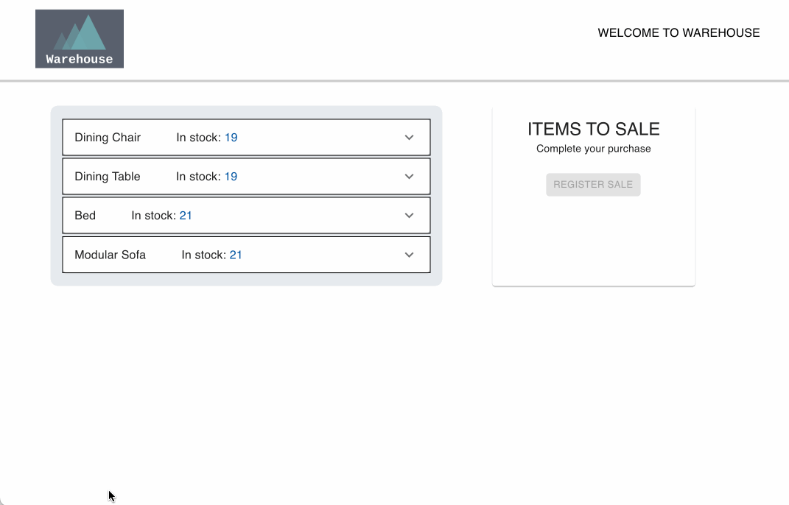
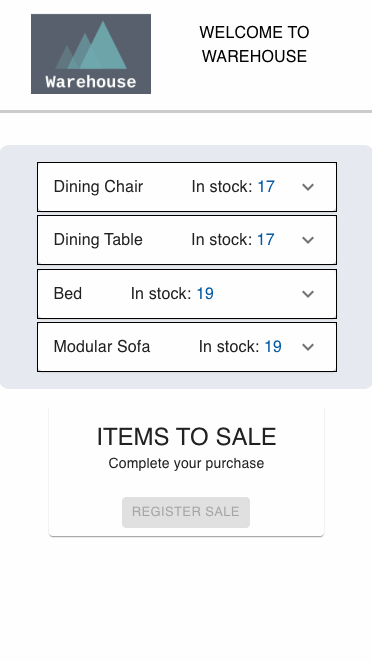

# Warehouse UI web project in React and Typescript

---

## About the application:

A fully responsive frontend for a warehouse solution’s API was implemented, where when user open application, there are displayed:

- the available products (name and quantity)
- the available articles for each product (name and quantity)
- the cart for making a sale
- the user has the ability to select the available products, register a sale and see current/updated data

The API is sometimes unreliable, so I wrapped the axios requests in a try-catch block with the ability to retry the request. This allows the user to work with the application without receiving errors, although there are errors and they are caught by us under the hood.

## Demo

### Desktop view:

### Mobile view:

## Considerations I would make for another iteration:

- be able to recalculate articles on the counter on the fly
- implement component / snapshot tests
- add State management tool (e.x Redux, Zustand or MobX etc.) as data grows and a large number of entities

The best practice would be to have all the logic for calculating products and articles performed on the server side. And the frontend would receive ready-made data.

## Used technologies:

I chose `React` as it is a very popular frontend development framework and using `Typescript` for typing, it will save a lot of development time by prompting the developer and helping to debug the code.

To work with the API, I used `axios`, a promise-based HTTP Client for node.js and the browser. It is very simple and easy to use.

I also used `Material UI`. MUI provides a simple, customizable, and accessible library of React components. In order to customize these components, I preferred to use `Styled Components`. Styled Components is one of the most popular CSS-in-JS library. This means that when we're defining our styles, we're actually creating a normal React component that has our styles attached to it.

In order to find and fix problems in Javascript code, I use `ESLint`.

`Prettier` is used to format the code. It removes all original styling and ensures that all outputted code conforms to a consistent style.

## Quick Start

1. Clone (or download) the project, run:
   `git clone https://github.com/irookanji/warehouse_ui.git`

2. Run `npm install` to install npm dependencies.

3. Run `npm start` to run the project.

4. Open browser at `localhost:3000`.

5. Start customizing it with your own ideas.
